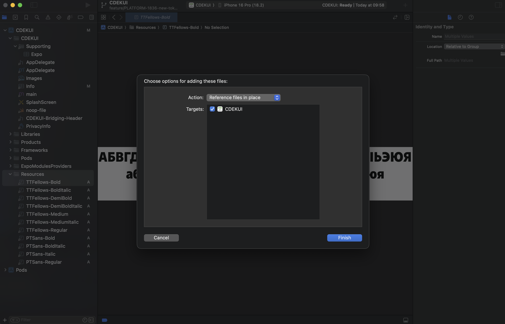

# react-native-ui-kit

Репозиторий UI kit на основе Prime Faces, Prime Flex для React Native

## Installation

```shell
yarn add --save-exact @cdek-it/react-native-ui-kit
yarn add react react-native @tabler/icons-react-native react-native-svg react-native-reanimated
```

## Шрифты

UI kit использует следующие виды шрифтов.

| Тип шрифта  | Используемые начертания                        | Рекомендуемый шрифт | Рекомендуемый аналог |
| ----------- | ---------------------------------------------- | ------------------- | -------------------- |
| `primary`   | – regular<br/>– demibold<br/>– demibold italic | TT Fellows          | PT Sans              |
| `secondary` | – regular<br/>– bold                           | PT Sans             | —                    |

Исходники шрифтов не поставляются вместе с пакетом, их требуется подключать
отдельно. После подключения шрифтов в проект, необходимо указать их в
`ThemeContextProvider`.

```tsx
<ThemeContextProvider
  fonts={{ primary: 'MyFont', secondary: 'MySecondaryFont' }}
/>
```

### Пример подключения шрифтов с помощью expo-fonts через плагин

```ts
[
  'expo-font',
  {
    android: {
      fonts: [
        {
          fontFamily: 'TT Fellows',
          fontDefinitions: [
            {
              path: './assets/fonts/TTFellows-DemiBoldItalic.ttf',
              weight: 600,
              style: 'italic',
            },
            {
              path: './assets/fonts/TTFellows-DemiBold.ttf',
              weight: 600,
            },
            { path: './assets/fonts/TTFellows-Regular.ttf', weight: 400 },
          ],
        },
        {
          fontFamily: 'PT Sans',
          fontDefinitions: [
            { path: './assets/fonts/PTSans-Bold.ttf', weight: 700 },
            { path: './assets/fonts/PTSans-Regular.ttf', weight: 400 },
          ],
        },
      ],
    },
  },
],
```

### Ручная установка

#### Android

1. Скопировать нужные шрифты в директорию `android/app/src/main/res/font`
2. Создать XML-ресурс для каждого шрифта

   ```xml
    <!-- xml_pt_sans.xml -->
   <font-family xmlns:app="http://schemas.android.com/apk/res-auto">
     <font app:font="@font/pt_sans_bold" app:fontStyle="normal" app:fontWeight="700"/>
     <font app:font="@font/pt_sans_regular" app:fontStyle="normal" app:fontWeight="400"/>
   </font-family>
   ```

   ```xml
   <!-- xml_tt_fellows.xml -->
   <font-family xmlns:app="http://schemas.android.com/apk/res-auto">
   <font app:font="@font/tt_fellows_demi_bold_italic" app:fontStyle="italic" app:fontWeight="600"/>
   <font app:font="@font/tt_fellows_demi_bold" app:fontStyle="normal" app:fontWeight="600"/>
   <font app:font="@font/tt_fellows_regular" app:fontStyle="normal" app:fontWeight="400"/>
   </font-family>
   ```

3. Добавить в метод `onCreate()` класса
   [MainApplication](./android/app/src/main/java/ru/cdek/uikit/prime/MainApplication.kt)
   следующий код:

   ```kotlin
    override fun onCreate() {
      super.onCreate()

      //подключение шрифтов
      ReactFontManager.getInstance().addCustomFont(this, "TT Fellows", R.font.xml_tt_fellows)
      ReactFontManager.getInstance().addCustomFont(this, "PT Sans", R.font.xml_pt_sans)

      // остальной код...
    }
   ```

#### iOS

1. Добавить шрифты в проект Xcode

   Для этого открыть Xcode вашего проекта, создать новую группу Resources
   (опционально), перетащить туда файлы с шрифтами.

   Можно выбрать Copy files или Reference files, на ваш выбор

   

2. Добавить информацию о шрифтах в [Info.plist](./ios/CDEKUI/Info.plist)

   ```xml
   <key>UIAppFonts</key>
   <array>
   <string>TTFellows-DemiBold.ttf</string>
   <string>TTFellows-DemiBoldItalic.ttf</string>
   <string>TTFellows-Regular.ttf</string>
   <string>PTSans-Bold.ttf</string>
   <string>PTSans-Regular.ttf</string>
   </array>
   ```

## Dependencies

Для использования данной библиотеки необходимо:

- react версии - начиная с 18 major версии (от 18.0.0)
- react-native - любой версии(оптимально - от 0.74)
- @tabler/icons-react-native - начиная с 3 major версии(от 3.0.0)
- react-native-svg - начиная с 15 major версии(от 15.0.0)
- react-native-reanimated - начиная с 3 major версии(от 3.0.0)

## Development

`yarn install` - установка зависимостей `yarn start` - запуск Metro Bundler для
Storybook `yarn ios` - запуск Storybook на iOS `yarn android` - запуск Storybook
на Android

Storybook проект создан с помощью Expo

### Макеты

[https://developer.cdek.ru/design-system](https://developer.cdek.ru/design-system)
